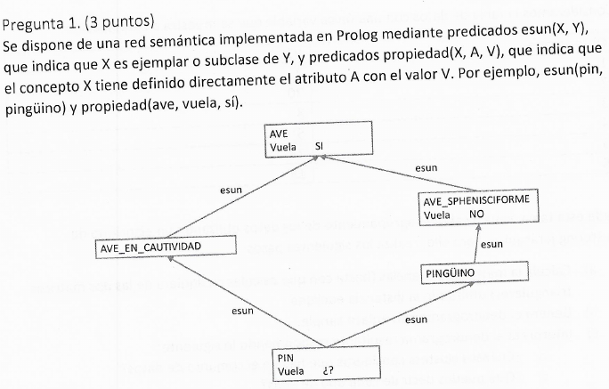
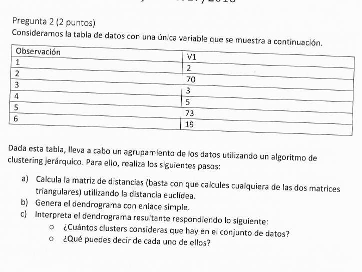

# Inteligencia Artificial
## Junio 2018

### 1. [3 puntos]

% propiedad(X,Y,B):- X B puede efectuar propiedad Y
% "X: clase"
% "Y: propiedad"
% "B: booleano que implica si puede o no € [sí,no]"

propiedad(AVE, vuela, sí).
propiedad(AVE_SPHENISCIFORME, vuela, no).

% es_un(X,Y):- X es un Y.
% "X: instancia"
% "Y: clase"

es_un(AVE_SPHENISCIFORME,AVE).
es_un(PINGÜINO,AVE_SPHENISCIFORME).
es_un(PIN,PINGÜINO).
es_un(PIN,AVE_EN_CAUTIVIDAD).
es_un(AVE_EN_CAUTIVIDAD,AVE).

% tieneProp1(X,A,V): se cumple tanto para las propiedades definidas directamente en concepto X como para las que hereda.
tieneProp1(X,A,V):- (es_un(X,Y),
					propiedad(Y,A,V));
					propiedad(X,A,V).

% Distancia Inferencial: la distancia infrencial entre dos conceptos define un orden parcial: concepto1 está más cerca de concepto2 que de concepto3 **si y solo si** concepto1 tiene un camino de inferencia a través de concepto2 hasta concepto3.

% distancia(Concepto1, Concepto2) < distancia(Concepto1, Concepto3) ⇔∃camino(Concepto1, Concepto2, Concepto3

% tieneProp2: equivalente al 1 pero considerando la herencia múltiple.
% tieneProp2(X,A,V) mismo que tieneProp1 pero si hay herencia múltiple, se selecciona el concepto situado a menos distancia inferencial

% ascendiente(Y,X):- Y ascendiente de X
ascendiente(Y,X):- es_un(X,Y).
ascendiente(Y,X):- es_un(X,Z),
				   ascendiente(Z,Y).

% ascendienteValor(Y,X,A,V):- Y ascendiente de X y tiene definido directamente atributo A con valor V
ascendienteValor(Y,X,A,V):- ascendiente(Y,X),
							propiedad(Y,A,V).

% listaCandidatos(X,A,L):- devuelve lista de pares (Y,V) sien do Y ascendiente de X y V el valor del atributo A definido directamente en Y
listaCandidatos(X,A,L):- setof((Y,V),ascendienteValor(Y,X,A,V),L).

### 2. [2 puntos]

Consideramos la tabla de datos con una única variable: 

a) Calcula la matriz de distanfcias (basta con que calcules cualquiera de las dos matrices triangulares) utilizando la distancia euclídea.

b) Genera el dendograma con enlace simple.

c) Interpreta el dendograma resultante respondiendo lo siguiente:
	- Cuántos clusters consideras que hay en el conjunto de datos?
	- ¿Qué puedes decir de cada uno de ellos?
