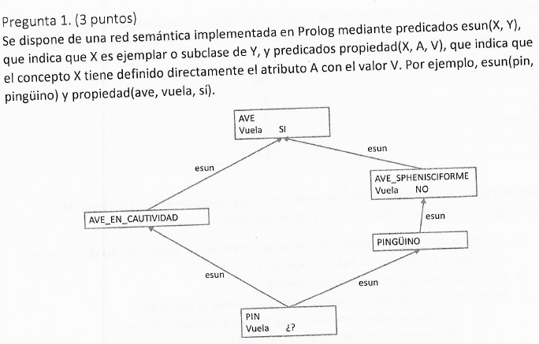
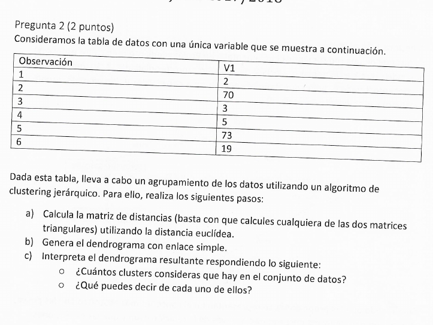
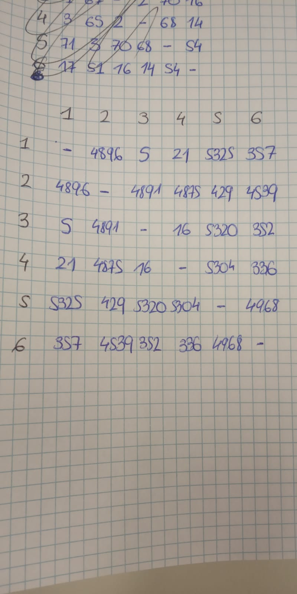
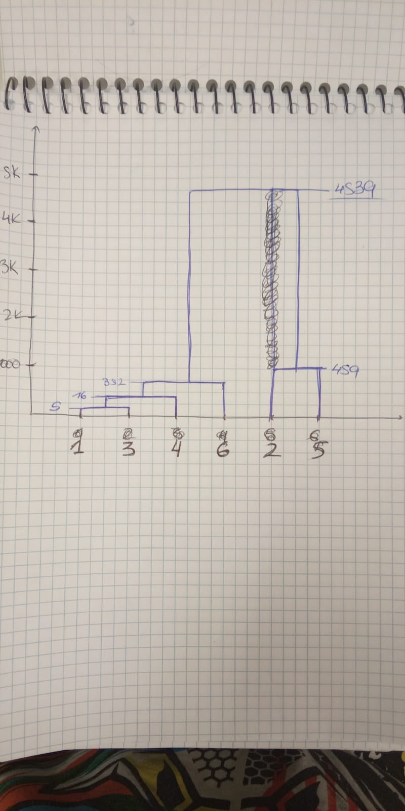

# Inteligencia Artificial
## Junio 2018

### 1. [3 puntos]

% propiedad(X,Y,B):- X B puede efectuar propiedad Y
% "X: clase"
% "Y: propiedad"
% "B: booleano que implica si puede o no € [sí,no]"

propiedad(AVE, vuela, sí).
propiedad(AVE_SPHENISCIFORME, vuela, no).

% es_un(X,Y):- X es un Y.
% "X: instancia"
% "Y: clase"

es_un(AVE_SPHENISCIFORME,AVE).
es_un(PINGÜINO,AVE_SPHENISCIFORME).
es_un(PIN,PINGÜINO).
es_un(PIN,AVE_EN_CAUTIVIDAD).
es_un(AVE_EN_CAUTIVIDAD,AVE).

% tieneProp1(X,A,V): se cumple tanto para las propiedades definidas directamente en concepto X como para las que hereda.
tieneProp1(X,A,V):- (es_un(X,Y),
					propiedad(Y,A,V));
					propiedad(X,A,V).

% Distancia Inferencial: la distancia infrencial entre dos conceptos define un orden parcial: concepto1 está más cerca de concepto2 que de concepto3 **si y solo si** concepto1 tiene un camino de inferencia a través de concepto2 hasta concepto3.

% distancia(Concepto1, Concepto2) < distancia(Concepto1, Concepto3) ⇔∃camino(Concepto1, Concepto2, Concepto3

% tieneProp2: equivalente al 1 pero considerando la herencia múltiple.
% tieneProp2(X,A,V) mismo que tieneProp1 pero si hay herencia múltiple, se selecciona el concepto situado a menos distancia inferencial

% ascendiente(Y,X):- Y ascendiente de X
ascendiente(Y,X):- es_un(X,Y).
ascendiente(Y,X):- es_un(X,Z),
				   ascendiente(Z,Y).

% ascendienteValor(Y,X,A,V):- Y ascendiente de X y tiene definido directamente atributo A con valor V
ascendienteValor(Y,X,A,V):- ascendiente(Y,X),
							propiedad(Y,A,V).

% listaCandidatos(X,A,L):- devuelve lista de pares (Y,V) sien do Y ascendiente de X y V el valor del atributo A definido directamente en Y
listaCandidatos(X,A,L):- setof((Y,V),ascendienteValor(Y,X,A,V),L).

### 2. [2 puntos]

Consideramos la tabla de datos con una única variable: 

a) Calcula la matriz de distanfcias (basta con que calcules cualquiera de las dos matrices triangulares) utilizando la distancia euclídea.

b) Genera el dendograma con enlace simple.

c) Interpreta el dendograma resultante respondiendo lo siguiente:
	- Cuántos clusters consideras que hay en el conjunto de datos?
	- ¿Qué puedes decir de cada uno de ellos?
	
Considero que hay 2 clusters:
	- Cluster {1,3,4,6} (distancia 357)
	- Cluster {2,5} 	(distancia 429)
	
Puedo decir que son dos clusters bastante homogéneos en el interior y heterogéneos entre sí (distanciados a 4539).

### 3. [2 puntos]

Considera las técnicas de los árboles de decisión y los k vecinos más cercanos en el contexto de un problema de clasificación.

a) Describe brebemente las diferencias entre ambas técnicas.

k-NN se utiliza para clustering de variables mientras que los árboles de decisión se usan para problemas de clasificación.
k-NN determina los clusters, por lo que debe existir una medida métrica entre las variables (implica que todas las características **deben ser numéricas**).
DT predice una clase para un vector de entrada dado, en el que los atributos pueden ser numéricos o no.
Si queremos encontrar ejemplos similares a otros dados, usaríamos k-NN. DT lo usaríamos para clasificar ejemplos.

¿Cuál de ellas prefererías usar en cada uno de los siguientes casos? Razona muy brevemente la respuesta.

b) Los elementos están descritos por variables de entrada numéricas de rangos muy diferentes y por variables categóricas (atributo normal).

En este caso usaría un Decision Tree ya que al aumentar las dimensiones los vecinos suelen estar bastante lejos.

c) Al realizar clustering jerárquico de los datos utilizando únicamente las variables de entrada vemos que cada uno de los custers se puede identificar de forma clara con alguna de las clases de la variable de salida.

En este caso podemos usar un árbol de decisión

d) Estamos interesados en descubrir cómo se relacionan las variables de entrada y la variable de salida para conocer más sobre el dominio del problema.

¿?¿?

### 4. [3 puntos]

Se quiere automatizar parcialmente el proceso de cración de una red semántica. Para ello, se pide desarrollar un programa en prolog que lea frases simples como listas de palabras y utilice una DCG para analizarlas y devolver estructuras que, a continuación, puedan ser asertadas como hechos Prolog.

El programa hará lo siguiente hasta leer una frase vacía que finalizará el proceso:
	- Leer una frase.
	- Analizar su corrección sintáctica.
	- Asertar el correspondiente hecho Prolog.
Se valorará la escabilidad del programa desarrollado.

a) Considérense frases de clasificación como las siguientes:
FRASE									HECHO ASERTADO
Los elefantes son vertebrados.		esun(elefante,vertebrado).
Las rana son anfibios.				esun(rana,anfibio).
Las mesas son muebles.				esun(mesa,mueble).

Puedes usar siguiente predicado Prolog:
	
asserta(P) que añade la cláusula P a la base de conocimientos.

		es_articulo(Los).
		es_articulo(Las).
		
		es_verbo(son).
		
		sintax() -->
			[V],
			{	name(V,FraseCadena)
				append(ArticuloCad, NombreCad, VerboCad, CNCad),
				name(ArticuloCad,Articulo),
				es_articulo(Articulo),
				name(VerboCad,Verbo),
				es_verbo(Verbo),
				name(Nombre,NombreCad),
				name(CN,CNCad),
				asserta(esun(Nombre,CN))
			}.

b) Extiende la gramática para tratar propiedades expresadas con frases de este tipo:

FRASE									HECHO ASERTADO
El color de los elefantes es gris.	color(elefante,gris).
El color de las ranas es verde.		color(rana,verde).
La forma de las mesas es redonda.	forma(mesa,redonda).

Puedes usar siguiente predicado prolog:

Propiedad = ..[P,X,Y] que asigna a Propiedad el término P(X,Y).

Ejemplo: Propiedad = ..[color,elefante,gris] asigna a propiedad el término color(elefante,gris).

Este predicado prolog puede usarse combinado con *asserta* para evitar tener que crear una regla diferente para cada propiedad (forma, color, etc.).

		es_propiedad(color).
		es_propiedad(forma).
		
		es_articulo(El).
		es_articulo(La).
		es_articulo(los).
		es_articulo(las).
		
		es_verbo(es).
		
		es_preposicion(de).
		
		sintax(Propiedad, Nombre, Verbo, CN) -->
			[V],
			{	name(V,FraseCadena)
				append(ArticuloCad, PropiedadCad, PreposicionCad, Articulo2Cad, VerboCad, NombreCad, CNCad),
				name(Articulo,ArticuloCad),
				es_articulo(Articulo),
				name(Propiedad,PropiedadCad),
				es_propiedad(Propiedad),
				name(Preposicion,PreposicionCad),
				es_preposicion(Preposicion),
				name(Articulo2,Articulo2Cad),
				es_articulo(Articulo2),
				name(Verbo,VerboCad),
				es_verbo(Verbo),
				//¿Cómo compruebo que Nombre es Nombre?
			}.