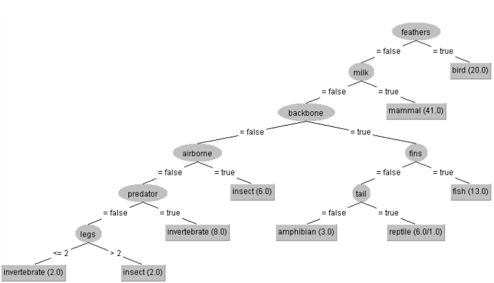
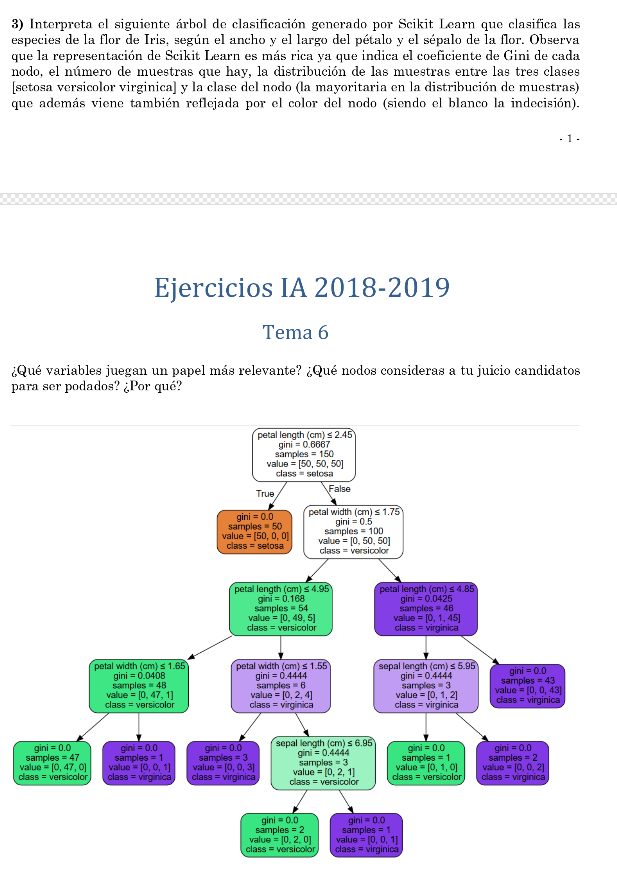

# Inteligencia Artificial - Tutoría

## 0. Dudas
1. Hoja 7:
	- ¿Qué hay que hacer para que PROLOG te produzca salidas? Es decir, la diferencia entre ej1 y ej2 es que en ej1 te pone persona = ..., numero = .... ¿Cómo puedo conseguir eso en ej2?
	- EJERCICIO 2: ¿Qué esta ocurriendo?	
			?- concordancia(I,T,P,N,PP,NP,[yoamaré],[]).
			primeraprimerasingularsingular
			I = amar,
			T = futuro,
			P = PP, PP = primera,
			N = NP, NP = singular .

2. Hoja 5:
    - EJERCICIO 1: ¿está bien hecho? ¿Cómo se infiere última consulta?
    - EJERCICIO 2: ¿bienlas transitivas?
    - EJERCICIO 3: ¿está bien?
    - EJERCICIO 4: ¿bien hecho? ¿Qué significa?
    
3. Hoja 6
    - EJERCICIO 2: ¿Cómo sé qué variables son más relevantes? ¿Las que están arriba,no?
    - EJERCICIO 3: ¿Cómo sé cuáles son?
    - EJERCICIO 4: ¿Cómo se saca la PRECISIÓN GLOBAL? ¿Cómo se cuentan los VERDADEROS NEGATIVOS?

4. Jun18
	- EJERCICIO 1: ¿está bien?
	- EJERCICIO 2: ¿Está bien pasado de la tabla al gráfico?

## 1. HOJA 5
### 1.1. EJERCICIO 1

**¿Está bien hecho? ¿Cómo se infiere la última consulta?**

	es_un(elefante_circense,elefante).
	tiene_parte(elefante,cabeza).
	tiene_parte(elefante,trompa).
	tiene_parte(cabeza,boca).
	es_un(elefante,animal).
	tiene_parte(animal,corazón).
	es_un(elefante_circense,acróbata).
	tiene_parte(acróbata,disfraz).
	es_un(disfraz,ropa).
	
	% ?- es_un(elefante_circense,animal).

	% HAY QUE AÑADIR HERENCIA A ES_UN
	es_un(X,Z):- es_un(X,Y),
	es_un(Y,Z).

	% ?- tiene_parte(elefante_circense,corazón).
	tiene_parte(X,Y):- es_un(X,Z),
					   tiene_parte(Z,Y).

	% ?- tiene_parte(elefante_circense,boca).
	tiene_parte(X,Y):- tiene_parte(X,Z),t
					   tiene_parte(Z,Y).
                   
**¿Cómo es esta?**                   

	% ?- tiene_parte(elefante_circense,ropa).
	tiene_parte(X,Y):- ?¿

### 1.2. EJERCICIO 2

**¿Están bien las consultas?**

	% prestamo(+X,+Y,+Z):- X le prestó a Y el objeto Z.
	prestamo(Juan,María,Coche).     % "Juan le prestó su coche a María" 
	prestamo(María,Pablo,Coche).    % "Después María se lo prestó a Pablo"

	% enfado(+X,+Y,+Z):- X se enfadó con Y por el motivo Z.
	enfado(Juan,María,prestamo(María,Pablo,Coche)). % "Esto provocó que Juan se enfadara"
	
	marca(Coche,Seat).
	es_un(Seat,Coche).
	es_un(Coche,Vehículo).
	tiene_parte(Coche,Sistema Eléctrico).
	tiene_parte(Sistema Eléctrico,Batería).
	tiene_parte(Batería,Ácido).
	es_un(Ácido,Producto Químico).

	% "¿El coche de Juan es un vehículo?"
	es_un(X,Z):- es_un(X,Y),
				 es_un(Y,Z).

	% "¿El coche de Juan tiene Sistema Eléctrico?"
	tiene_parte(X,Y):- es_un(X,Z),
					   tiene_parte(Z,Y).

	% "¿El coche de Juan tiene batería?"
	tiene_parte(X,Y):- tiene_parte(X,Z),
					   tiene_parte(Z,Y).

	% "¿El coche de Juan tiene un producto químico?"
	tiene_parte(X,Y):- tiene_parte(X,Z),
	es_un(Z,Y).

### 1.3. EJERCICIO 3

**¿Está bien?**

	% arista(?NombreR,+Origen,+Destino)
	% "NombreR : nombre de la relación que une Origen y Destino € [es_un, tiene_parte]"
	% "Origen  : punto desde el que se parte"
	% "Destino : punto a donde se llega"
	
	% hereda(tiene_parte,es_un)
	% "Se hereda la propiedad tiene_parte a través de la relación es_un"
	
	% es_un(B,A).
	
	arista(es_un,B,A).
	
	% tiene_parte(A,C).
	arista(tiene_parte,A,C).
	hereda(tiene_parte,es_un):- arista(es_un,X,Y),
	arista(tiene_parte,Y,Z).

### 1.4. EJERCICIO 4

**¿Está bien hecho? ¿Qué significa cada uno de los parámetros de busq_rel?**

	% relacion_repetida(+C1, +C2, ?Relacion, ?NumRep)
	% "C1       : concepto 1 de la relación"
	% "C2       : concepto 2 de la relación"
	% "Relacion : nombre de la relación"
	% "NumRep   : número repeticiones relación"

	% arista(NRelación,Origen,Destino).

	relacion_repetida(C1,C2,R,NR):-
		relacion_repetida_aux(C1,C2,R,NR) ; relacion_repetida_aux(C2,C1,R,NR).

	relacion_repetida_aux(C1,C2,R,1):-
		arista(R,C1,C2).

	relacion_repetida_aux(C1,C2,R,N):-
		arista(R,C1,X),
		relacion_repetida_aux(X,C2,R,M),
		N is M + 1.

	% camino(+C1,+C2,?CadRel)
	% "C1     : concepto 1 de la relación"
	% "C2     : concepto 2 de la relación"
	% "CadRel : cadena de relaciones que une C1 y C2"

	camino(X,X,[X]).
	camino(X,Y,[X,R | []]):-
	arista(X,Z,R),
	camino(Z,Y,R).
	% busq_rel(+C1,+C2,?CadRel).

	busq_rel(X,X,[X],[X],X).
		% Arcos dirigidos desde X

	busq_rel(X,Y,Camino,[Y],Y):-
		camino(X,Y,Camino).
		% Arcos dirigidos desde Y

	busq_rel(X,Y,[X],Camino,X):-
		camino(Y,X,Camino).
		% Arcos desde X y desde Y

	busq_rel(X,Y,[X,R1 | Izda],[Y,R2 | Dcha],I):-
		arista(R1,X,Z1),
		arista(R2,Y,Z2),

	busq_rel(Z1,Z2,Izda,Dcha,I).

## 2. HOJA 6
### 2.1. EJERCICIO 2

**¿Cómo se qué variables son más relevantes? Las quue están arriba, ¿no?**

### 2.2. EJERCICIO 3

**¿Cómo puedo saber qué variables son más relevantes?**

### 2.3. EJERCICIO 4

**¿Cómo se cuentan verdaderos negativos?
¿Se puede obtener precisión/exhaustividad global?**

## 3. HOJA 7
### 3.1. Prolog
**¿Qué hay que hacer para que PROLOG te produzca salidas?**
**Es decir, la diferencia entre ej1 y ej2 es que en ej1 te pone persona = ..., numero = .... ¿Cómo puedo conseguir eso en ej2?**

### 3.2. EJERCICIO 2
**¿Qué ocurre aquí?**

	% DCG
	concordancia(Infinitivo, Tiempo, Persona, Número, PersonaPron, NúmeroPron) -->
		[V],
		{ 	name(V, FraseCad),		% FraseCad = listaCarac[V]
			append(PronCad,VerboCad, FraseCad),		% prueba todas las combianciones posibles de dividir FraseCad en dos
			name(Pronombre, PronCad),
			es_pronombre(Pronombre, PersonaPron, NúmeroPron),	
			name(Verbo, VerboCad),
			append(RaizCad, TerminacionCad, VerboCad),
			name(Raiz, RaizCad),
			es_verbo(Raiz, Infinitivo),
			name(Terminacion, TerminacionCad),
			es_terminacion(Terminacion, Tiempo, Persona, Número),
			%write(Persona),
			%write(PersonaPron),
			%write(Número),
			%write(NúmeroPron),
			Número == NúmeroPron,
			Persona == PersonaPron
		}.

**SALIDA:**

	?- concordancia(I,T,P,N,PP,NP,[yoamaré],[]).
				primeraprimerasingularsingular
				I = amar,
				T = futuro,
				P = PP, PP = primera,
	N = NP, NP = singular 

## 4. Jun18
### 4.1. EJERCICIO 1
