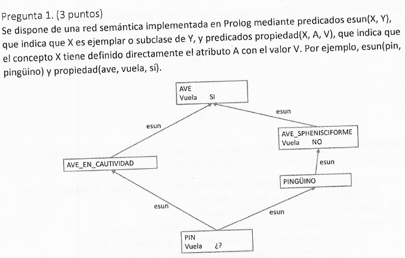
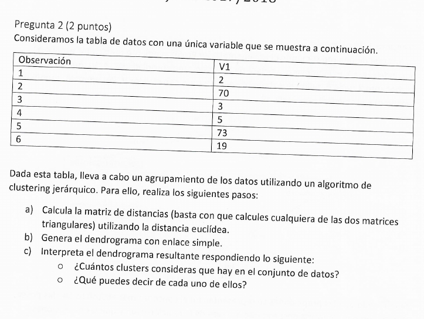
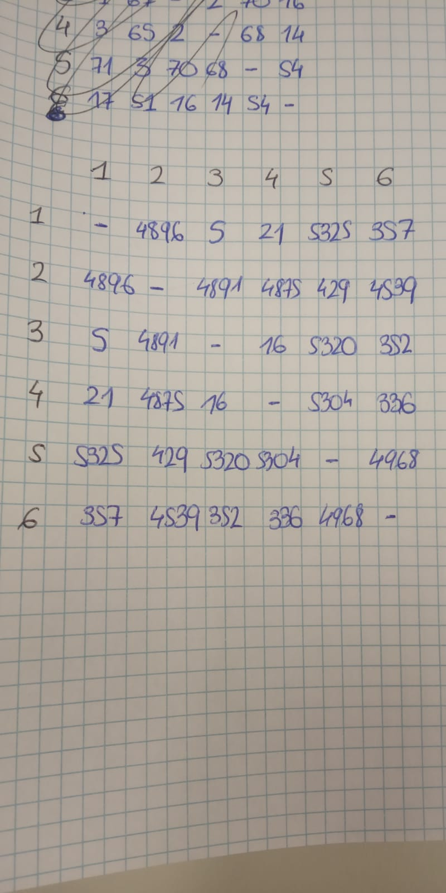
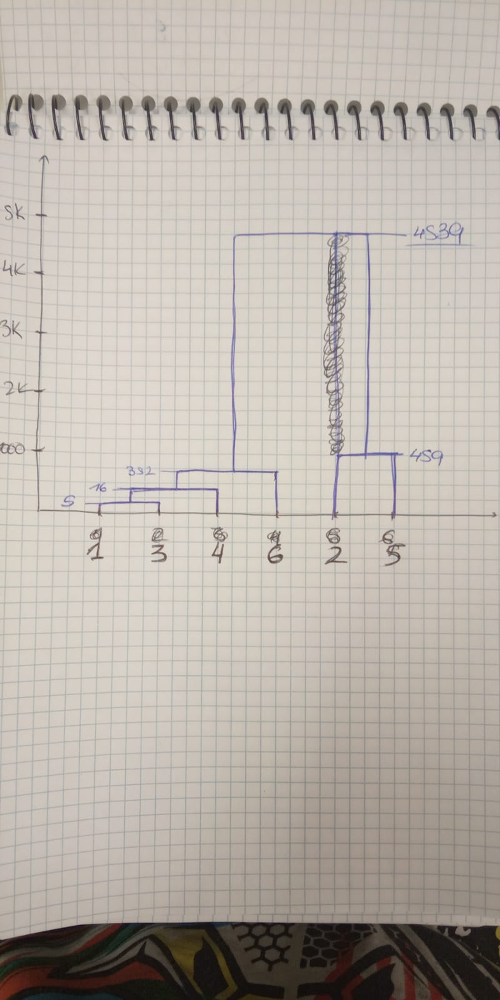

# Inteligencia Artificial - Tutoría

## 0. Dudas
1. Hoja 7:
	- ¿Qué hay que hacer para que PROLOG te produzca salidas? Es decir, la diferencia entre ej1 y ej2 es que en ej1 te pone persona = ..., numero = .... ¿Cómo puedo conseguir eso en ej2?
	- EJERCICIO 2: ¿Qué esta ocurriendo?	
			?- concordancia(I,T,P,N,PP,NP,[yoamaré],[]).
			primeraprimerasingularsingular
			I = amar,
			T = futuro,
			P = PP, PP = primera,
			N = NP, NP = singular .

2. Hoja 5:
    - EJERCICIO 1: ¿está bien hecho? ¿Cómo se infiere última consulta?
    - EJERCICIO 2: ¿bienlas transitivas?
    - EJERCICIO 3: ¿está bien?
    - EJERCICIO 4: ¿bien hecho? ¿Qué significa?
    
3. Hoja 6
    - EJERCICIO 2: ¿Cómo sé qué variables son más relevantes? ¿Las que están arriba,no?
    - EJERCICIO 3: ¿Cómo sé cuáles son?
    - EJERCICIO 4: ¿Cómo se saca la PRECISIÓN GLOBAL? ¿Cómo se cuentan los VERDADEROS NEGATIVOS?

4. Jun18
	- EJERCICIO 1: ¿está bien?
	- EJERCICIO 2: ¿Está bien pasado de la tabla al gráfico?

## 1. HOJA 5
### 1.1. EJERCICIO 1

**¿Está bien hecho? ¿Cómo se infiere la última consulta?**

	es_un(elefante_circense,elefante).
	tiene_parte(elefante,cabeza).
	tiene_parte(elefante,trompa).
	tiene_parte(cabeza,boca).
	es_un(elefante,animal).
	tiene_parte(animal,corazón).
	es_un(elefante_circense,acróbata).
	tiene_parte(acróbata,disfraz).
	es_un(disfraz,ropa).
	
	% ?- es_un(elefante_circense,animal).

	% HAY QUE AÑADIR HERENCIA A ES_UN
	es_un(X,Z):- es_un(X,Y),
	es_un(Y,Z).

	% ?- tiene_parte(elefante_circense,corazón).
	tiene_parte(X,Y):- es_un(X,Z),
					   tiene_parte(Z,Y).

	% ?- tiene_parte(elefante_circense,boca).
	tiene_parte(X,Y):- tiene_parte(X,Z),t
					   tiene_parte(Z,Y).
                   
**¿Cómo es ésta?**                   

	% ?- tiene_parte(elefante_circense,ropa).
	tiene_parte(X,Y):- ?¿

### 1.2. EJERCICIO 2

**¿Están bien las consultas?**

	% prestamo(+X,+Y,+Z):- X le prestó a Y el objeto Z.
	prestamo(Juan,María,Coche).     % "Juan le prestó su coche a María" 
	prestamo(María,Pablo,Coche).    % "Después María se lo prestó a Pablo"

	% enfado(+X,+Y,+Z):- X se enfadó con Y por el motivo Z.
	enfado(Juan,María,prestamo(María,Pablo,Coche)). % "Esto provocó que Juan se enfadara"
	
	marca(Coche,Seat).
	es_un(Seat,Coche).
	es_un(Coche,Vehículo).
	tiene_parte(Coche,Sistema Eléctrico).
	tiene_parte(Sistema Eléctrico,Batería).
	tiene_parte(Batería,Ácido).
	es_un(Ácido,Producto Químico).

	% "¿El coche de Juan es un vehículo?"
	es_un(X,Z):- es_un(X,Y),
				 es_un(Y,Z).

	% "¿El coche de Juan tiene Sistema Eléctrico?"
	tiene_parte(X,Y):- es_un(X,Z),
					   tiene_parte(Z,Y).

	% "¿El coche de Juan tiene batería?"
	tiene_parte(X,Y):- tiene_parte(X,Z),
					   tiene_parte(Z,Y). 

	% "¿El coche de Juan tiene un producto químico?"
	tiene_parte(X,Y):- tiene_parte(X,Z),
					   es_un(Z,Y).

### 1.3. EJERCICIO 3

**¿Está bien?**

	% arista(?NombreR,+Origen,+Destino)
	% "NombreR : nombre de la relación que une Origen y Destino € [es_un, tiene_parte]"
	% "Origen  : punto desde el que se parte"
	% "Destino : punto a donde se llega"
	
	% hereda(tiene_parte,es_un)
	% "Se hereda la propiedad tiene_parte a través de la relación es_un"
	
	% es_un(B,A).
	
	arista(es_un,B,A).
	
	% tiene_parte(A,C).
	arista(tiene_parte,A,C).
	hereda(tiene_parte,es_un):- arista(es_un,X,Y),
	arista(tiene_parte,Y,Z).

### 1.4. EJERCICIO 4

**¿Está bien hecho? ¿Qué significa cada uno de los parámetros de busq_rel?**

	% relacion_repetida(+C1, +C2, ?Relacion, ?NumRep)
	% "C1       : concepto 1 de la relación"
	% "C2       : concepto 2 de la relación"
	% "Relacion : nombre de la relación"
	% "NumRep   : número repeticiones relación"

	% arista(NRelación,Origen,Destino).

	relacion_repetida(C1,C2,R,NR):-
		relacion_repetida_aux(C1,C2,R,NR) ; relacion_repetida_aux(C2,C1,R,NR).

	relacion_repetida_aux(C1,C2,R,1):-
		arista(R,C1,C2).

	relacion_repetida_aux(C1,C2,R,N):-
		arista(R,C1,X),
		relacion_repetida_aux(X,C2,R,M),
		N is M + 1.

	% camino(+C1,+C2,?CadRel)
	% "C1     : concepto 1 de la relación"
	% "C2     : concepto 2 de la relación"
	% "CadRel : cadena de relaciones que une C1 y C2"

	camino(X,X,[X]).
	camino(X,Y,[X,R | []]):-
	arista(X,Z,R),
	camino(Z,Y,R).
	% busq_rel(+C1,+C2,?CadRel).

	busq_rel(X,X,[X],[X],X).
		% Arcos dirigidos desde X

	busq_rel(X,Y,Camino,[Y],Y):-
		camino(X,Y,Camino).
		% Arcos dirigidos desde Y

	busq_rel(X,Y,[X],Camino,X):-
		camino(Y,X,Camino).
		% Arcos desde X y desde Y

	busq_rel(X,Y,[X,R1 | Izda],[Y,R2 | Dcha],I):-
		arista(R1,X,Z1),
		arista(R2,Y,Z2),

	busq_rel(Z1,Z2,Izda,Dcha,I).

## 2. HOJA 6
### 2.1. EJERCICIO 2

**¿Cómo se qué variables son más relevantes? Las quue están arriba, ¿no?**

### 2.2. EJERCICIO 3

**¿Cómo puedo saber qué variables son más relevantes?**

### 2.3. EJERCICIO 4

**¿Cómo se cuentan verdaderos negativos?
¿Se puede obtener precisión/exhaustividad global?**

## 3. HOJA 7
### 3.1. Prolog
**¿Qué hay que hacer para que PROLOG te produzca salidas?**
**Es decir, la diferencia entre ej1 y ej2 es que en ej1 te pone persona = ..., numero = .... ¿Cómo puedo conseguir eso en ej2?**

### 3.2. EJERCICIO 2
**¿Qué ocurre aquí?**

	% DCG
	concordancia(Infinitivo, Tiempo, Persona, Número, PersonaPron, NúmeroPron) -->
		[V],
		{ 	name(V, FraseCad),		% FraseCad = listaCarac[V]
			append(PronCad,VerboCad, FraseCad),		% prueba todas las combianciones posibles de dividir FraseCad en dos
			name(Pronombre, PronCad),
			es_pronombre(Pronombre, PersonaPron, NúmeroPron),	
			name(Verbo, VerboCad),
			append(RaizCad, TerminacionCad, VerboCad),
			name(Raiz, RaizCad),
			es_verbo(Raiz, Infinitivo),
			name(Terminacion, TerminacionCad),
			es_terminacion(Terminacion, Tiempo, Persona, Número),
			%write(Persona),
			%write(PersonaPron),
			%write(Número),
			%write(NúmeroPron),
			Número == NúmeroPron,
			Persona == PersonaPron
		}.

**SALIDA:**

	?- concordancia(I,T,P,N,PP,NP,[yoamaré],[]).
				primeraprimerasingularsingular
				I = amar,
				T = futuro,
				P = PP, PP = primera,
	N = NP, NP = singular 

## 4. Jun18
### 4.1. EJERCICIO 1

	

	% propiedad(X,Y,B):- X B puede efectuar propiedad Y
	% "X: clase"
	% "Y: propiedad"
	% "B: booleano que implica si puede o no € [sí,no]"

	propiedad(AVE, vuela, sí).
	propiedad(AVE_SPHENISCIFORME, vuela, no).

	% es_un(X,Y):- X es un Y.
	% "X: instancia"
	% "Y: clase"

	es_un(AVE_SPHENISCIFORME,AVE).
	es_un(PINGÜINO,AVE_SPHENISCIFORME).
	es_un(PIN,PINGÜINO).
	es_un(PIN,AVE_EN_CAUTIVIDAD).
	es_un(AVE_EN_CAUTIVIDAD,AVE).
**¿Está bien?**

	% tieneProp1(X,A,V): se cumple tanto para las propiedades definidas directamente en concepto X como para las que hereda.
	tieneProp1(X,A,V):- (es_un(X,Y),
						propiedad(Y,A,V));
						propiedad(X,A,V).

	% Distancia Inferencial: la distancia infrencial entre dos conceptos define un orden parcial: concepto1 está más cerca de concepto2 que de concepto3 **si y solo si** concepto1 tiene un camino de inferencia a través de concepto2 hasta concepto3.

	% distancia(Concepto1, Concepto2) < distancia(Concepto1, Concepto3) ⇔∃camino(Concepto1, Concepto2, Concepto3
**¿Está bien?**

	% tieneProp2: equivalente al 1 pero considerando la herencia múltiple.
	% tieneProp2(X,A,V) mismo que tieneProp1 pero si hay herencia múltiple, se selecciona el concepto situado a menos distancia inferencial

**¿Está bien?**

	% ascendiente(Y,X):- Y ascendiente de X
	ascendiente(Y,X):- es_un(X,Y).
	ascendiente(Y,X):- es_un(X,Z),
					   ascendiente(Z,Y).
**¿Está bien?**

	% ascendienteValor(Y,X,A,V):- Y ascendiente de X y tiene definido directamente atributo A con valor V
	ascendienteValor(Y,X,A,V):- ascendiente(Y,X),
								propiedad(Y,A,V).
**¿Está bien?**

	% listaCandidatos(X,A,L):- devuelve lista de pares (Y,V) sien do Y ascendiente de X y V el valor del atributo A definido directamente en Y
	listaCandidatos(X,A,L):- setof((Y,V),ascendienteValor(Y,X,A,V),L).

### 4.2. EJERCICIO 2

Consideramos la tabla de datos con una única variable: 

a) Calcula la matriz de distanfcias (basta con que calcules cualquiera de las dos matrices triangulares) utilizando la distancia euclídea.

**¿Bien calculada? (Calcular distancia euclídea y rellenar)**

b) Genera el dendograma con enlace simple.

**Solo pasar datos de matriz, verdad?**

c) Interpreta el dendograma resultante respondiendo lo siguiente:
	- Cuántos clusters consideras que hay en el conjunto de datos?
	- ¿Qué puedes decir de cada uno de ellos?
	
Considero que hay 2 clusters:
	- Cluster {1,3,4,6} (distancia 357)
	- Cluster {2,5} 	(distancia 429)
	
Puedo decir que son dos clusters bastante homogéneos en el interior y heterogéneos entre sí (distanciados a 4539).

### 4.3. EJERCICIO 3

Considera las técnicas de los árboles de decisión y los k vecinos más cercanos en el contexto de un problema de clasificación.

a) Describe brebemente las diferencias entre ambas técnicas.

	k-NN se utiliza para clustering de variables mientras que los árboles de decisión se usan para problemas de clasificación.
	k-NN determina los clusters, por lo que debe existir una medida métrica entre las variables (implica que todas las características **deben ser numéricas**).
	DT predice una clase para un vector de entrada dado, en el que los atributos pueden ser numéricos o no.
	Si queremos encontrar ejemplos similares a otros dados, usaríamos k-NN. DT lo usaríamos para clasificar ejemplos.

**¿Cómo se cuál usar en cada caso?**

*Yo entiendo que kNN solo se puede usar con variables NUMÉRICAS, y DT es mejor para relacionar un vector entrada con una salida.*

¿Cuál de ellas prefererías usar en cada uno de los siguientes casos? Razona muy brevemente la respuesta.

b) Los elementos están descritos por variables de entrada numéricas de rangos muy diferentes y por variables categóricas (atributo normal).

	En este caso usaría un Decision Tree ya que al aumentar las dimensiones los vecinos suelen estar bastante lejos.

c) Al realizar clustering jerárquico de los datos utilizando únicamente las variables de entrada vemos que cada uno de los custers se puede identificar de forma clara con alguna de las clases de la variable de salida.

	En este caso podemos usar un árbol de decisión

d) Estamos interesados en descubrir cómo se relacionan las variables de entrada y la variable de salida para conocer más sobre el dominio del problema.

¿?¿?
**¿Cómo sería esto?**

### 4.4. EJERCICIO 4

Se quiere automatizar parcialmente el proceso de cración de una red semántica. Para ello, se pide desarrollar un programa en prolog que lea frases simples como listas de palabras y utilice una DCG para analizarlas y devolver estructuras que, a continuación, puedan ser asertadas como hechos Prolog.

El programa hará lo siguiente hasta leer una frase vacía que finalizará el proceso:
	- Leer una frase.
	- Analizar su corrección sintáctica.
	- Asertar el correspondiente hecho Prolog.
Se valorará la escabilidad del programa desarrollado.

a) Considérense frases de clasificación como las siguientes:
FRASE									HECHO ASERTADO
Los elefantes son vertebrados.		esun(elefante,vertebrado).
Las rana son anfibios.				esun(rana,anfibio).
Las mesas son muebles.				esun(mesa,mueble).

Puedes usar siguiente predicado Prolog:
	
asserta(P) que añade la cláusula P a la base de conocimientos.

		es_articulo(Los).
		es_articulo(Las).
		
		es_verbo(son).
		
		sintax() -->
			[V],
			{	name(V,FraseCadena)
				append(ArticuloCad, NombreCad, VerboCad, CNCad),
				name(ArticuloCad,Articulo),
				es_articulo(Articulo),
				name(VerboCad,Verbo),
				es_verbo(Verbo),
				name(Nombre,NombreCad),
				name(CN,CNCad),
				asserta(esun(Nombre,CN))
			}.

b) Extiende la gramática para tratar propiedades expresadas con frases de este tipo:

FRASE									HECHO ASERTADO
El color de los elefantes es gris.	color(elefante,gris).
El color de las ranas es verde.		color(rana,verde).
La forma de las mesas es redonda.	forma(mesa,redonda).

Puedes usar siguiente predicado prolog:

Propiedad = ..[P,X,Y] que asigna a Propiedad el término P(X,Y).

Ejemplo: Propiedad = ..[color,elefante,gris] asigna a propiedad el término color(elefante,gris).

Este predicado prolog puede usarse combinado con *asserta* para evitar tener que crear una regla diferente para cada propiedad (forma, color, etc.).

		es_propiedad(color).
		es_propiedad(forma).
		
		es_articulo(El).
		es_articulo(La).
		es_articulo(los).
		es_articulo(las).
		
		es_verbo(es).
		
		es_preposicion(de).
		
		sintax(Propiedad, Nombre, Verbo, CN) -->
			[V],
			{	name(V,FraseCadena)
				append(ArticuloCad, PropiedadCad, PreposicionCad, Articulo2Cad, VerboCad, NombreCad, CNCad),
				name(Articulo,ArticuloCad),
				es_articulo(Articulo),
				name(Propiedad,PropiedadCad),
				es_propiedad(Propiedad),
				name(Preposicion,PreposicionCad),
				es_preposicion(Preposicion),
				name(Articulo2,Articulo2Cad),
				es_articulo(Articulo2),
				name(Verbo,VerboCad),
				es_verbo(Verbo),
				//¿Cómo compruebo que Nombre es Nombre?
			}.

**¿Cómo compruebo que Nombre es correcto? Al final va nombre + propiedad y poner todos los colores o todas las formas para asegurar que gris es propiedad igual es ineficiente.**

## 5. JUNIO 2015
### 5.1. EJERCICIO 2

